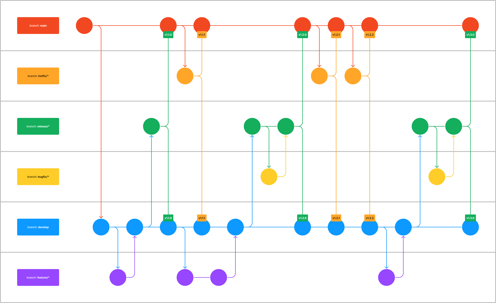

# Branching Strategy

## Context

Not having alignment on a branching strategy can lead to a lot of confusion and
frustration. This document aims to provide a clear and concise branching
strategy for the team to follow.

## Decision

The branching strategy will be based on the
[Gitflow Workflow](https://www.atlassian.com/git/tutorials/comparing-workflows/gitflow-workflow)
with some minor tweaks.

### Visualization



### Branch Categories

**Main:** Initial branch and the only one to be deployed to UAT and PRD.

**Develop:** A parallel dynamic branch, from which features are branched out and
committed to. This will be the one deployed to DEV.

**Features:** When starting on a user story, a `feature/*` branch should be
created, branching out from `develop`. Once the complete features is developed,
this will be squashed and merged back into the `develop` branch.

**Releases:** Once all the features are developed for a specific release, a
`release/*` branch is created that can be tested and stabilized before it's
merged into `main`. The most recent one will be the one deployed to TST.

**Hotfixes:** If a serious issue needs to be corrected on production, a
`hotfix/*` branch is created for the fix. This is squashed and merged back into
`main`. _Remember to merge `main` into `develop`!_

**Bugfixes:** If a bug has been found in a `release/*`, a `bugfix/*` branch is
created for the fix. This is squashed and merged back into the `release/*`.

### Naming Conventions

Naming of branches use kebab-case and should follow the following semantics:

- `bugfix/[story number]-[first four words from user story]`
- `feature/[story number]-[first four words from user story]`
- `hotfix/[story number]-[first four words from user story]`
- `release/1.[sprint number].[increment for each fix]`

### Examples

#### Task REVAMP-1234

- Should branch out from the `develop` branch
- The corresponding branch will be named:
  `feature/REVAMP-1234-single-user-login-web`

#### Bug #REVAMP-XXX found on DEV

- Should branch out from the `develop` branch it should fix
- The corresponding branch will be named:
  `bugfix/REVAMP-XXX-wrong-metadata-in-header`

#### Bug #REVAMP-XXX found on TST

- Should branch out from the `release/*` branch it should fix
- The corresponding branch will be named:
  `bugfix/REVAMP-XXX-wrong-metadata-in-header`

#### Critical bug #REVAMP-XXX found on PRD

- Should branch out from the `main` branch
- The corresponding branch will be named:
  `hotfix/REVAMP-XXX-wrong-metadata-in-header`

## Merging

```txt
feature/123-login
   │  (Squash merge)
   ▼
develop
   │  (Basic merge)
   ▼
release/2.3.0
   │  (Basic merge)
   ▼
main
   │  (Basic merge)
   ▼
develop (sync back from main)
```

| Target Branch | Allowed Merge Types | Purpose                                     |
| ------------- | ------------------- | ------------------------------------------- |
| `develop`     | ✅ Squash ✅ Basic  | Merge feature branches and sync from `main` |
| `release/*`   | ✅ Basic only       | Stabilize release before production         |
| `main`        | ✅ Basic only       | Production-ready code                       |
| `feature/*`   | (no policy)         | Individual feature work merged into develop |

## Consequences

**Positive:** A clear and concise branching strategy will help the team to work
more efficiently.

**Negative:** It will require a lot of discipline to follow the strategy.
