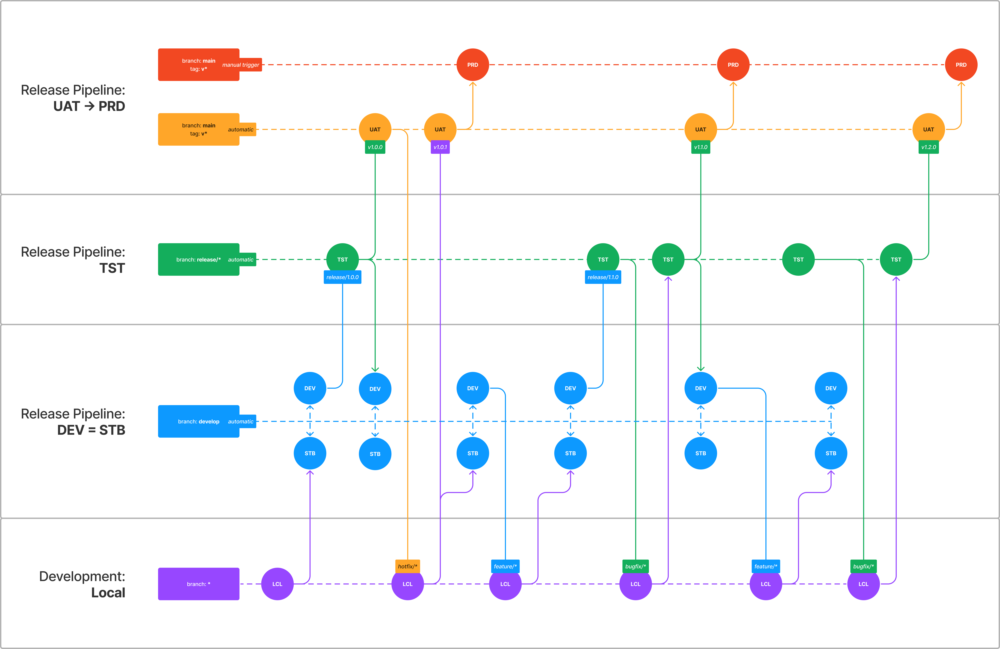

# Deployment Strategy

## Context

Not having a deployment strategy that is aligned across crafts and projects is
risky as it can lead to confusion and miscommunication.

## Decision

We will use the following deployment strategy as visualized below:

### Environments

#### Development: `Local`

This is where all development happens. All features, bugfixes and hotfixes are
developed locally and pushed to create Pull Requests.

#### Release Pipeline: `DEV = STB`

DEV is short for "Development". STB is short for "Storybook".

These two releases should always be built from the same commit and should be
automatically deployed when PR's are completed and merged into the `develop`
branch.

#### Release Pipeline: `TST`

TST is short for "Test" (also known as "Staging"). This release should be
automatically deployed when a `release/*` branch is created or committed to.

#### Release Pipeline: `UAT -> PRD`

UAT is short for "User Acceptance Testing". This part of the release should be
automatically deployed when a new `v*` tag is added to the `main` branch.

PRD is short for "Production". This part of the release should be manually
deployed. And only by IT Operations upon agreement with the client.

## Consequences

**Positive:** Following this strategy will ensure that all environments are
always in sync and that the right version of the code is always deployed to the
correct environment.
